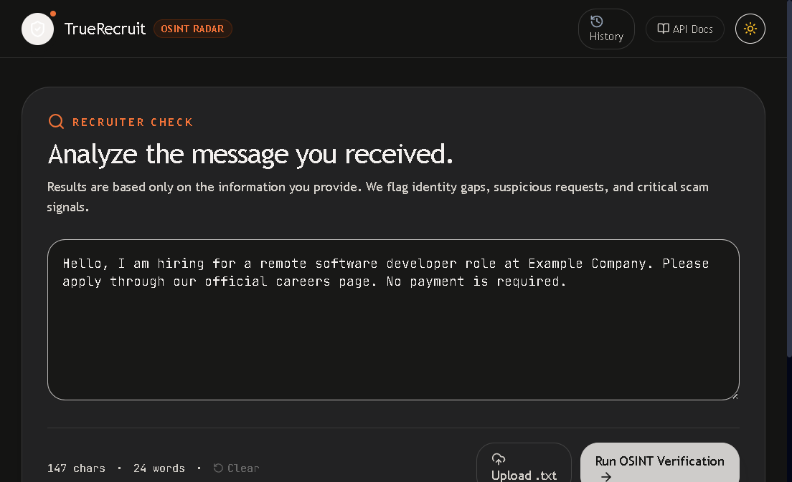

# Fake Recruitment Verifier

<div align="center">




[](https://fastapi.tiangolo.com)
[](https://react.dev)
[](https://vitejs.dev)
[](https://tailwindcss.com)
[](https://serpapi.com)

**A transparent screening aid for checking job postings and recruiter messages against public web evidence.**

[Quick start](#quick-start) · [How it works](#how-it-works) · [API](#api-reference) · [Benchmark](#benchmark-and-accuracy) · [Limitations](#limitations)

</div>

> **Important:** This project is not a fraud detector, legal service, background check, or guarantee that a job is safe. Never send money, identity documents, bank credentials, or one-time passwords because a result looks legitimate.

## Table of contents

- [What the project does](#what-the-project-does)
- [How it works](#how-it-works)
- [Features](#features)
- [Repository structure](#repository-structure)
- [Quick start](#quick-start)
- [Configuration](#configuration)
- [API reference](#api-reference)
- [Scoring model](#scoring-model)
- [Benchmark and accuracy](#benchmark-and-accuracy)
- [Testing](#testing)
- [Deploying the frontend](#deploying-the-frontend)
- [Limitations](#limitations)
- [Privacy and security](#privacy-and-security)
- [Troubleshooting](#troubleshooting)

## What the project does

Fake Recruitment Verifier helps a candidate review a job posting or recruiter message before replying. It combines:

- structured extraction of company, recruiter, email, domain, role, salary, address, and payment claims;
- public search evidence from SerpApi;
- grounded reasoning from Groq when configured;
- transparent evidence links and snippets;
- a deterministic 0–100 heuristic risk score;
- plain-English safety guidance.

The application is designed to answer **“what should I verify next?”**, not to make an irreversible **“this is definitely a scam”** decision.

## How it works

The current analysis pipeline follows this sequence:

```text
Posting or recruiter message
        |
        v
Groq extracts externally verifiable claims
        |
        v
Groq plans targeted Google / News / Maps searches
        |
        v
SerpApi retrieves public evidence
        |
        v
Groq labels evidence:
supports / contradicts / unrelated / ambiguous
        |
        +--> up to 2 bounded follow-up search rounds
        |
        v
Deterministic rules calculate the final risk score
        |
        v
Groq writes a grounded explanation with checked citations
```

### Grounding and safety rules

- A claim must be copied from the submitted text.
- A judgment must cite a returned evidence snippet.
- Mock and failed search responses are never treated as live evidence.
- Follow-up searches are capped in code, not just requested in the prompt.
- Groq does not control the numeric score.
- The deterministic scorer remains the final authority for `risk_score` and `verdict`.
- The API accepts text today. For screenshots, run OCR first and submit the extracted text.

## Features

- **Claim-driven OSINT:** search plans are tailored to the claims found in each posting.
- **LLM-first extraction:** Groq structured JSON extraction with field-by-field grounding.
- **Regex fallback:** the service remains usable when Groq is unavailable, malformed, or unconfigured.
- **Lookalike-domain checks:** edit-distance and common homoglyph checks against apparent official domains.
- **RDAP context:** domain registration age is shown when available but does not automatically change the score.
- **Evidence audit:** claims, queries, source status, snippets, judgments, follow-ups, and citations are returned.
- **Deterministic score:** repeatable rule-based risk score from 0 to 100.
- **Local history:** scan results can be re-opened from browser `localStorage`.
- **Export:** download a Markdown or JSON forensic report.
- **Referral leads:** when appropriate, public LinkedIn search matches may be shown as leads; they are not confirmed employees.
- **Demo mode:** without SerpApi, the app can run with simulated results clearly marked as mock.

## Repository structure

```text
fake-recruitment-verifier/
├── backend/
│   ├── app/
│   │   ├── main.py             # FastAPI app and POST /check
│   │   ├── models.py           # Pydantic request, response, and audit models
│   │   ├── claim_pipeline.py   # Claims, search plans, evidence, judgments, follow-ups
│   │   ├── extraction.py       # Groq extraction plus grounded regex fallback
│   │   ├── groq_analysis.py    # Groq decisions and domain selection helpers
│   │   ├── serpapi_client.py   # Async SerpApi client and SQLite cache
│   │   ├── signals.py           # Text rules and reusable legacy signal helpers
│   │   ├── scoring.py           # Deterministic 0–100 heuristic score
│   │   ├── config.py            # Environment-backed settings
│   │   └── cache.py             # 24-hour SQLite query cache
│   ├── tests/                  # Backend unit, integration, and pipeline tests
│   ├── benchmark_real_postings.py
│   ├── requirements.txt
│   └── run.py
├── frontend/
│   ├── src/
│   │   ├── App.jsx
│   │   ├── components/
│   │   ├── hooks/
│   │   └── services/
│   ├── package.json
│   └── vite.config.js
├── docs/assets/scan-flow.gif   # README product walkthrough
├── .env.example
├── netlify.toml
└── README.md
```

## Quick start

### Prerequisites

- Python 3.10 or newer
- Node.js 18 or newer
- npm
- Optional: SerpApi API key for live public searches
- Optional: Groq API key for LLM extraction, claim planning, evidence judgment, and explanations

### 1. Clone and enter the repository

```powershell
git clone https://github.com/kunal-yelgate/fake-recruitment-verifier.git
Set-Location fake-recruitment-verifier
```

### 2. Create and activate a Python environment

Windows PowerShell:

```powershell
python -m venv .venv
.\.venv\Scripts\Activate.ps1
```

If PowerShell blocks activation for the current terminal:

```powershell
Set-ExecutionPolicy -Scope Process -ExecutionPolicy Bypass
.\.venv\Scripts\Activate.ps1
```

macOS/Linux:

```bash
python3 -m venv .venv
source .venv/bin/activate
```

### 3. Install backend dependencies

Run this from the repository root:

```bash
python -m pip install -r backend/requirements.txt
```

### 4. Configure environment variables

Copy the template:

PowerShell:

```powershell
Copy-Item .env.example .env
```

macOS/Linux:

```bash
cp .env.example .env
```

Then edit `.env`:

```env
SERPAPI_KEY=your_serpapi_key_here
GROQ_API_KEY=your_groq_api_key_here
GROQ_MODEL=llama-3.3-70b-versatile
HOST=0.0.0.0
PORT=8000
DEBUG=True
```

Never commit `.env` or paste API keys into source code, tests, screenshots, issues, or chat. If a key is exposed, revoke it and create a replacement.

### 5. Start the backend

Run from the repository root so the root `.env` is loaded:

```bash
python backend/run.py
```

Backend URLs:

- API: <http://127.0.0.1:8000>
- Health: <http://127.0.0.1:8000/health>
- Swagger: <http://127.0.0.1:8000/docs>
- ReDoc: <http://127.0.0.1:8000/redoc>

### 6. Start the frontend

Open a second terminal:

```bash
cd frontend
npm install
npm run dev
```

Open <http://localhost:5173>.

The frontend uses `VITE_API_BASE_URL` when provided. For local development, it defaults to the local backend.

## Configuration

| Variable | Required | Purpose |
|---|---:|---|
| `SERPAPI_KEY` | No | Enables live Google, Google News, and Google Maps searches. Without it, results are marked mock. |
| `GROQ_API_KEY` | No | Enables structured extraction, search planning, evidence judgments, follow-ups, and cited explanations. |
| `GROQ_MODEL` | No | Groq model name; defaults to `llama-3.3-70b-versatile`. |
| `HOST` | No | Backend bind host; defaults to `0.0.0.0`. |
| `PORT` | No | Backend port; defaults to `8000`. |
| `DEBUG` | No | Enables development reload behavior. |
| `CACHE_DB_PATH` | No | SQLite cache location; defaults to `app_cache.db`. |
| `CACHE_TTL_HOURS` | No | Search-cache lifetime; defaults to 24 hours. |
| `VITE_API_BASE_URL` | No | Frontend URL for a deployed FastAPI backend. |

Groq receives the submitted posting text when enabled. SerpApi receives planned search queries. Configure these providers only if that data sharing is acceptable.

## API reference

### `POST /check`

Request:

```json
{
  "raw_text": "Company: Example Labs\nRecruiter: Jamie Smith\nEmail: jamie@example.com\n..."
}
```

Important response fields:

```json
{
  "risk_score": 62,
  "verdict": "Caution",
  "verdict_badge": "warning",
  "extracted_fields": {
    "company_name": "Example Labs",
    "recruiter_name": "Jamie Smith",
    "claimed_domain": "example.com",
    "contact_email": "jamie@example.com",
    "job_title": "Software Engineer",
    "salary_range": "$120,000 - $150,000 per year",
    "payment_requests": [],
    "extraction_method": "groq"
  },
  "signals": [],
  "claim_audit": {
    "claims": [],
    "search_plan": [],
    "evidence": [],
    "judgments": [],
    "follow_ups": [],
    "explanation": {
      "text": "Verify the employer through its official careers site.",
      "citations": []
    },
    "rounds_completed": 0
  },
  "is_mock": false
}
```

The exact claims, signals, and citations depend on the submitted posting and provider responses. `risk_score` is a heuristic index, not a probability.

### Other endpoints

| Method | Path | Purpose |
|---|---|---|
| `GET` | `/health` | Health check |
| `GET` | `/cache/stats` | SQLite cache statistics |
| `GET` | `/docs` | Interactive Swagger documentation |
| `GET` | `/redoc` | ReDoc API documentation |

## Scoring model

The score starts at 50 and is clamped to the range 0–100:

```text
final_score = clamp(50 + sum(signal_deltas), 0, 100)
```

Current bands:

| Score | Verdict | Meaning |
|---:|---|---|
| 0–34 | Likely Legitimate | Few negative signals were found; this does not prove authenticity. |
| 35–64 | Caution | Evidence is mixed, incomplete, or needs manual verification. |
| 65–100 | Likely Scam | Strong warning signals were found; stop and independently verify before proceeding. |

The score is deterministic once the signal judgments are available. Groq may explain or judge evidence, but it does not directly choose the numeric score.

## Benchmark and accuracy

### What was measured

The repository includes [benchmark_real_postings.py](backend/benchmark_real_postings.py), which samples a balanced set from the public [Real or Fake Job Posting Prediction dataset](https://www.kaggle.com/datasets/shivamb/real-or-fake-fake-jobposting-prediction). The dataset is labeled with `fraudulent=0` or `fraudulent=1`.

Run it only with a valid SerpApi key:

```bash
python backend/benchmark_real_postings.py path/to/fake_job_postings.csv \
  --live \
  --seed 42 \
  --per-class 15 \
  --output benchmark-results/run.json
```

The runner:

- selects 15 legitimate and 15 fraudulent postings with a fixed seed;
- currently evaluates the legacy deterministic signal evaluator, not the new claim pipeline;
- rejects mock and provider-error responses;
- may use up to approximately 180 live searches;
- stores metrics and dataset row IDs, not posting text;
- treats only scores `>= 65` as predicted scams.

### Observed result

There is **no complete, valid accuracy score yet**.

The last authorized run stopped after an incomplete prefix because SerpApi returned fallback data:

| Metric | Incomplete result |
|---|---:|
| Evaluated postings | 18 of 30 |
| Accuracy | **4/18 = 22.2%** |
| True positives | 0 |
| False positives | 3 |
| True negatives | 4 |
| False negatives | 11 |
| Scam precision | 0% |
| Scam recall | 0% |

This **22.2% is not a valid project accuracy score**. It is an incomplete diagnostic that strongly suggests the current hand-authored weights and cutoff need calibration. It must not be generalized to the full dataset, and mock results must never be mixed with live results.

Before claiming accuracy, run a complete benchmark on a held-out sample with live results, inspect duplicate/near-duplicate postings, and report accuracy, balanced accuracy, scam precision, scam recall, specificity, and the confusion matrix.

## Testing

Backend tests:

```bash
$env:PYTHONPATH="backend"; pytest -q
```

macOS/Linux:

```bash
PYTHONPATH=backend pytest -q
```

Frontend production build:

```bash
cd frontend
npm install
npm run build
```

The test suite covers extraction, grounded Groq responses, claim grounding, search limits, provider failures, scoring, signal behavior, and the FastAPI endpoint.

## Deploying the frontend

The frontend is configured for **Netlify** through [`netlify.toml`](netlify.toml).

1. Import `kunal-yelgate/fake-recruitment-verifier` into Netlify.
2. Set the base directory to `frontend`.
3. Use build command `npm run build`.
4. Use publish directory `dist` relative to the base directory.
5. Set `VITE_API_BASE_URL` to the deployed FastAPI backend.
6. Add the final Netlify origin to the backend CORS allowlist.

The backend must be deployed separately to a Python-compatible host. Store `SERPAPI_KEY` and `GROQ_API_KEY` as deployment secrets.

## Limitations

- A small legitimate startup may have little or no Maps, LinkedIn, or news footprint and can receive caution signals.
- A scammer can copy a real company name, domain, job description, or employee identity.
- A company-domain match does not prove that the sender is employed by that company.
- Public search engines can return stale, irrelevant, duplicated, or misleading results.
- Groq can misunderstand messy, translated, or OCR-derived text; grounded validation reduces invention but does not guarantee correctness.
- Search-provider outages, quota limits, and rate limits can reduce evidence coverage.
- RDAP age is context only and does not prove that a domain is fraudulent.
- The current numeric weights are hand-authored heuristics and are not statistically calibrated.
- The current benchmark is incomplete and cannot support an accuracy claim.
- Screenshot upload and OCR are not implemented in the API.

## Privacy and security

- Do not commit `.env`, API keys, recruiter personal data, or private job documents.
- Use synthetic text when testing provider integrations.
- Treat public LinkedIn matches as possible referral leads, not confirmed employee identities.
- Verify the employer using a trusted company website that you navigate to independently.
- Never pay to apply for a job or deposit a check on behalf of an employer.
- If a provider key is exposed, revoke it immediately and replace it.

## Troubleshooting

### The frontend says “Failed to fetch”

Make sure the backend is running from the repository root:

```bash
python backend/run.py
```

Then check <http://127.0.0.1:8000/health>.

### Results say demo/mock mode

`SERPAPI_KEY` is missing, empty, invalid, or the provider returned a fallback response. Mock results are intentionally labeled and are not valid live evidence.

### Groq extraction is not shown

Check `GROQ_API_KEY`, restart the backend after editing `.env`, and inspect the returned `extraction_method`. The service falls back to regex when Groq fails.

### PowerShell cannot activate `.venv`

Run:

```powershell
Set-ExecutionPolicy -Scope Process -ExecutionPolicy Bypass
.\.venv\Scripts\Activate.ps1
```
