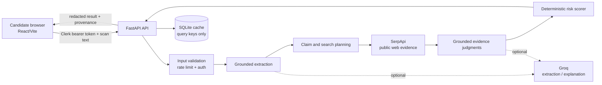

# Architecture and trust boundaries

TrueRecruit is a screening aid, not an identity authority. The browser owns
the submitted text and presentation state; the FastAPI service owns provider
credentials, bounded searches, evidence normalization, and deterministic
scoring.

## Data boundaries

- **Browser:** stores scan history in local `localStorage`. Clearing browser
  storage or using the history controls removes those local copies.
- **API:** receives the submitted text for the duration of a scan. It keeps
  provider credentials server-side and does not bundle them into the frontend.
- **Groq:** receives submitted text when configured for extraction, planning,
  evidence judgments, or explanations. Do not enable it for confidential
  documents unless that transfer is acceptable.
- **SerpApi:** receives bounded search queries derived from extracted claims,
  not API keys or the full posting by default.
- **SQLite cache:** stores provider query/result cache entries for the configured
  TTL. It is an operational cache, not a user-facing archive.

Mock or failed provider responses are marked as `demo` or `partial` and are
never presented as live evidence. The deterministic scorer remains in control
of the numeric score.
